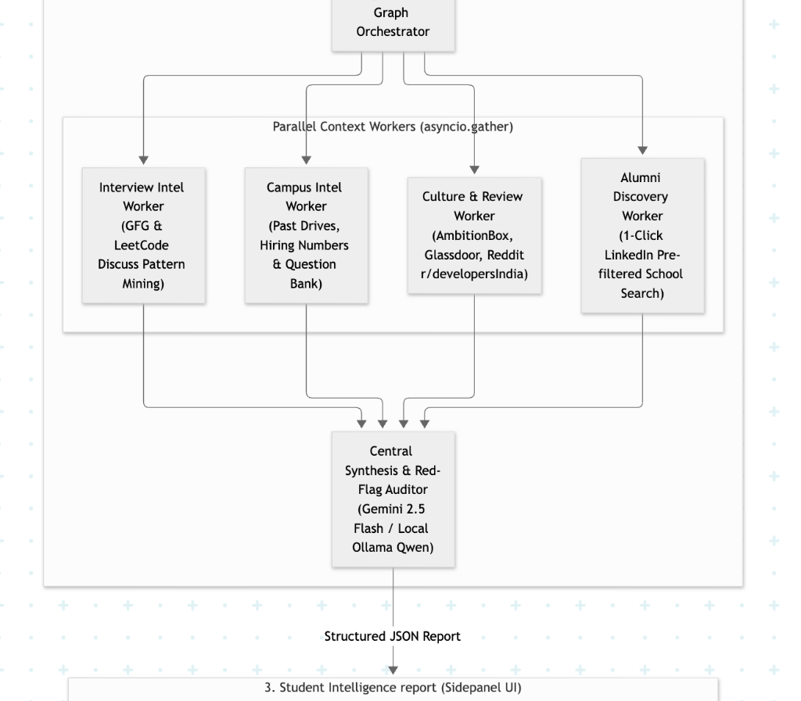
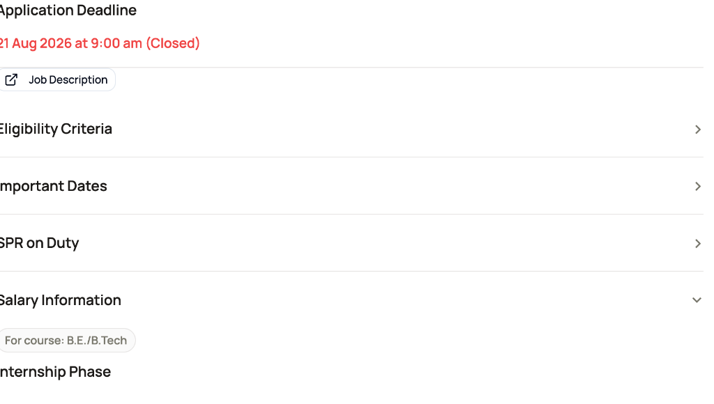
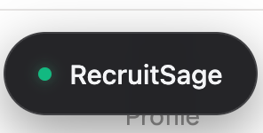

# RecruitSage Copilot — Thapar Placement Intelligence Copilot

**RecruitSage Copilot** is a local-first AI placement copilot built specifically for students at **Thapar Institute of Engineering & Technology (TIET)**.

It runs as a Chrome Extension side panel directly inside the Thapar placement portal ([recruit.thapar.edu](https://recruit.thapar.edu/)). When a student opens a company drive page, the extension automatically extracts the job details and runs a multi-agent research pipeline — covering company red flags, compensation breakdown, campus history, past interview questions, culture signals, alumni links, and a prep guide — all without any manual copy-paste.

---

## Demo Video

[Watch Demo on Google Drive](https://drive.google.com/file/d/1FnnzvYCqlYTWwdVc4CsBHxwgjSABef3X/view?usp=drive_link)

---

## Screenshots

**Input Panel — auto-extracts job details from the portal page**



**Analysis Pipeline — 6-step multi-agent research in progress**



**Campus Intel Tab — past drive records, CGPA cutoffs, and actual questions asked**


**Alumni Tab — 1-click LinkedIn search for Thapar seniors at the company**



---

## What It Does

- **Auto-extracts** job details (role, CTC, eligibility, skills, location) from the placement portal page
- **Runs a 17-point Red Flag audit** to flag bonding clauses, offer revocation history, CTC inflation, stagnant tech stacks, and more
- **Breaks down compensation** — CTC vs realistic monthly in-hand take-home
- **Pulls campus history** — previous visits, shortlist numbers, and exact past interview questions from Thapar drives
- **Searches the web** for Glassdoor/AmbitionBox ratings, Reddit threads (r/developersIndia), and news on the company
- **Generates direct LinkedIn alumni links** to Thapar seniors who worked at that company
- **Generates a prep guide** split into web-researched interview tips and real past-year questions from the campus question bank
- **AI chat panel** — ask follow-up questions, grounded in portal data and campus context to avoid hallucinations

---

## Architecture


---

## Data

| File | Description |
|---|---|
| `data/question_bank.csv` | 1,400+ campus interview questions across companies and roles, sourced from TietPrep Portal |
| `data/campus_placements.json` | Historical campus visit data (shortlists, PPOs, offers) |
| `data/optum.txt` | 13 past-year interview questions from Optum's Thapar campus drive |
| `data/campus_placements_template.json` | Template for adding new campus visit records |

---

## The 17-Point Red Flag Audit

Every company drive is automatically scanned against:

1. Low LinkedIn Footprint (< 5,000 Followers)
2. Ultra-Lean Team Size and Solo Fresher Syndrome
3. Newly Founded / Early-Stage Startup Runway Risk
4. Mandatory Unpaid / Sub-Minimum Wage Internship and PPO Baiting
5. Document and Marksheet Withholding (illegal under AICTE)
6. Service Bonds and Monetary Penalties
7. CTC Inflation vs Real In-Hand Pay
8. Delayed Joining Dates and Offer Revocation History
9. Probation Traps and Aggressive PIP Culture
10. Role Bait-and-Switch (hired as SDE, deployed to L1/L2 support)
11. Predatory Notice Periods and Excessive Non-Competes
12. Delayed Stipends and Irregular Salary Disbursal History
13. Toxic Management and Unpaid Overtime / Weekend Work Culture
14. Rotational and Night Shifts imposed on campus freshers
15. Mass Layoffs, Hiring Freezes, and Financial Instability
16. Shady Corporate Domain and Free Email Contacts
17. Stagnant Tech Stacks that harm future career mobility

---

## Tech Stack

| Layer | Technology |
|---|---|
| Chrome Extension | JavaScript, Chrome Extensions API (Manifest V3) |
| Backend | Python, FastAPI |
| AI (Cloud) | Google Gemini API |
| AI (Local) | Ollama — qwen2.5:7b (runs on Apple Metal GPU) |
| LLM Routing | Custom hybrid router (`llm_router.py`) |
| Web Search | DuckDuckGo via `search_service.py` |
| Name Matching | RapidFuzz fuzzy matching |
| Data | CSV + JSON flat files |

---

## Setup and Usage

### Step 1: Pull the Local Ollama Model
```bash
ollama run qwen2.5:7b
```
Runs locally on your Mac with Apple Metal GPU acceleration — no cloud cost.

---

### Step 2: Start the Backend
```bash
./run_backend.sh
```
- API runs at: `http://localhost:8000`
- Interactive API docs: `http://localhost:8000/docs`

---

### Step 3: Load the Chrome Extension
1. Open Chrome or Brave and go to `chrome://extensions/`
2. Enable **Developer mode** (top-right toggle)
3. Click **Load unpacked**
4. Select the `extension/` folder from this repo
5. The RecruitSage icon will appear in your toolbar

---

### Step 4: Add Your Campus Data (Optional)
Place your datasets in the `data/` folder:
- `data/campus_placements.json` — historical visit data (see template)
- `data/question_bank.csv` — export from Google Sheets as CSV

The system uses RapidFuzz to automatically match name variations (e.g., "DE Shaw" vs "D. E. Shaw & Co.").

---

### Step 5: Use It
1. Go to `https://recruit.thapar.edu/` and open any company drive page
2. Click the floating **"Recruit Copilot Intel"** button (bottom right) or open via the toolbar icon
3. The side panel opens, extracts the page context, and runs the research pipeline
4. Navigate through tabs:
   - **Red Flags** — 17-point audit result
   - **Compensation** — CTC breakdown vs realistic in-hand monthly pay
   - **Campus Intel** — previous visits, shortlist numbers, past interview questions
   - **Culture** — Glassdoor/AmbitionBox ratings and Reddit sentiment
   - **Alumni** — direct LinkedIn links to Thapar seniors at that company
   - **Prep Guide** — web-researched tips + real past-year campus questions (split by source)
   - **Ask AI** — streaming AI chat grounded in portal and campus data

---

## Current Status

- Chrome extension fully functional with side panel UI (light and dark mode)
- Backend pipeline working end-to-end: portal scrape -> orchestrator -> LLM -> response
- Gemini API and Ollama both supported via hybrid LLM router
- Company-specific question banks integrated (Optum/Thapar drive — 13 questions)
- Prep guide splits questions into web-researched tips and real past-year campus questions
- AI chat panel grounded in campus context to reduce hallucinations
- Sensitive data (compensation) blurred in UI for demo/recording purposes
- Question bank: 1,400+ questions across multiple companies and roles
